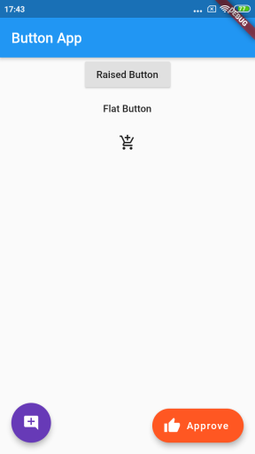

# flutter_first

A new Flutter application.

## Getting Started

This project is a starting point for a Flutter application.

A few resources to get you started if this is your first Flutter project:

- [Lab: Write your first Flutter app](https://flutter.dev/docs/get-started/codelab)
- [Cookbook: Useful Flutter samples](https://flutter.dev/docs/cookbook)

For help getting started with Flutter, view our
[online documentation](https://flutter.dev/docs), which offers tutorials,
samples, guidance on mobile development, and a full API reference.

--------

## What is inside app

- First Screen: **Hello Rectangle** in HelloRectangle.dart

- **AppBar**

  * App Basic : Basic App Bar with icon and opacity.
  * App Bar List View : App Bar with list view.
  * Tab Bar : App Tab Bar and Bottom Navigation Bar.
 

- **Calculator**

  Based on [Flutter Coding Challenge- Building a Calculator App](https://youtu.be/eVG5DkPF5x8)
  

- **Dart Basic** :
[Dart Basic for Java Developer Google CodeLab](https://codelabs.developers.google.com/codelabs/from-java-to-dart/index.html)

  * Functional programming, Interface, Constructor, Optional parameter, Abstract class.

- **Layouts**
 *Based On Udemy Tutorial* :

   * Grid : Grid View 
   * List Array : List View with fix element and with array list length elements.
   * Stack : For Overlapping Widget stack is used.
    
    
    
- **Input Selection**

   *Basic Input Widget* :
   
   * Button, Checkbox, RadioButton, Slider, Switch, TextField
   
<table>
  <tr>
    <td>
      
    </td>
    <td>
      
    </td>
    <td>
      
    </td>
  </tr>
</table>
   
<!--   -->
    
- **Drawer Route**

   *Navigation Drawer Widget* : Navigation drawer, diverting to demo page.
   
    
    
- **Navigation**

  *Notification widgets* : Alert dialog, Simple dialog, SnackBar.
<table>
  <tr>
    <td>
      
    </td>
    <td>
      
    </td>
    <td>
      
    </td>
  </tr>
</table>

- **Custom Widget**

   

